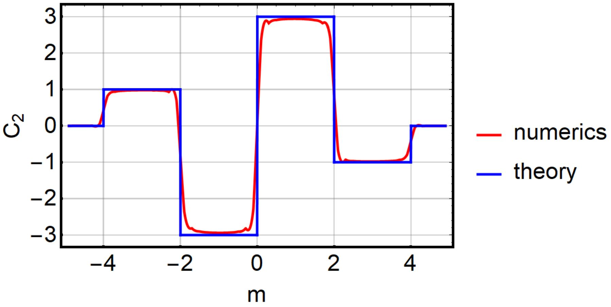

<section>
  <h2>Second Chern number</h2>
  
Mathematica code to compute the second Chern number of a four-dimensional (topological) band insulator, downloadable from <a   href="http://dx.doi.org/10.13140/RG.2.2.35088.12801">ResearchGate</a>. The code is an implementation of the algorithm discussed in M. Mochol-Grzelak, A. Dauphin, A. Celi, and M. Lewenstein, Quantum Sci. Technol. <b>4</b> 014009 (2019), DOI:<a href="https://doi.org/10.1088/2058-9565/aae93b">10.1088/2058-9565/aae93b</a> (where the algorithm's convergence is discussed too). 

  
The data plotted below correspond to hamiltonian: 

  
$$\mathcal{H}(k^\textrm{4D}) {=} \sum_{i=1}^4 \Gamma_i\sin k_i {+} \Gamma_5\left[m{+}\sum_{i=1}^4\cos k_i\right]$$

  
</section>

<section>
  <h2>Patch Euler class </h2>
  
Mathematica code that computes the <i>patch Euler class</i> of a pair of bands on a region (the patch) with a boundary. The patch Euler class is an invariant for systems with $C_2\mathcal{T}$-symmetry (and also for spinless systems with $\mathcal{PT}$-symmetry), which determines whether a pair of Dirac points are able to annihilate along a prescribed trajectory. The algorithm, as described in the supplementary material to A. Bouhon, Q.S. Wu, R.-J. Slager, H. Weng, O. V. Yazyev, and T. Bzdušek, Nat. Phys. <b>16</b>, 1137–1143 (2020), DOI:<a href="https://doi.org/10.1038/s41567-020-0967-9">10.1038/s41567-020-0967-9</a>, corresponds to a computationally efficient way to extract the most relevant bit of information from the non-Abelian topological invariant introduced previously in Q.S. Qu, A. A. Soluyanov, and T. Bzdušek, Science <b>365</b>, 1273–1277 (2019), DOI:<a href="https://doi.org/10.1126/science.aau8740">10.1126/science.aau8740</a>.
  

</section>
