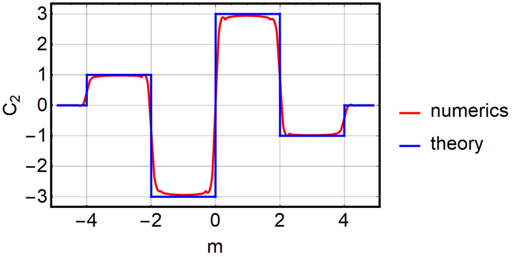

<section>
  <h2>Doctoral thesis</h2>
  <h3>Symmetry and topology of nodal semimetals (2017)</h3>
  
The work investigates the interplay of crystalline symmetry and topological singularities in several classes of topological semimetals. Following the introduction with my insights into topological band theory, the bulk of the work covers three works published during my PhD studies, namely:
    <ol>
      <li>Weyl semimetals in breathing pyrochlore oxides [T. Bzdušek, A. Rüegg, and M. Sigrist, Phys. Rev. B <b>91</b>, 165105 (2015), DOI:]<\li>
      <li>Nodal rings and chains imposed by non-symmorphic symmetry [].<\li>
      <li>Homotopy classification of generic band degeneracies []<\li>
    </ol>
    Mathematica code to compute the second Chern number of a four-dimensional (topological) band insulator, downloadable from <a href="http://dx.doi.org/10.13140/RG.2.2.35088.12801" target=”_blank”>ResearchGate</a>. The code is an implementation of the algorithm discussed in M. Mochol-Grzelak, A. Dauphin, A. Celi, and M. Lewenstein, Quantum Sci. Technol. <b>4</b> 014009 (2019), DOI:<a href="https://doi.org/10.1088/2058-9565/aae93b" target=”_blank”>10.1088/2058-9565/aae93b</a> (where the algorithm's convergence is discussed too). 

  
</section>
