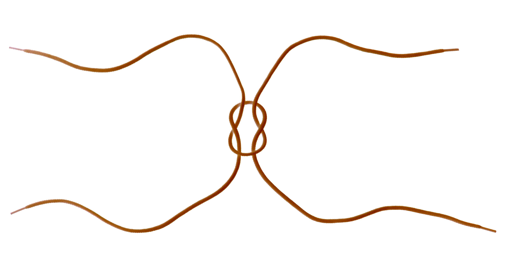
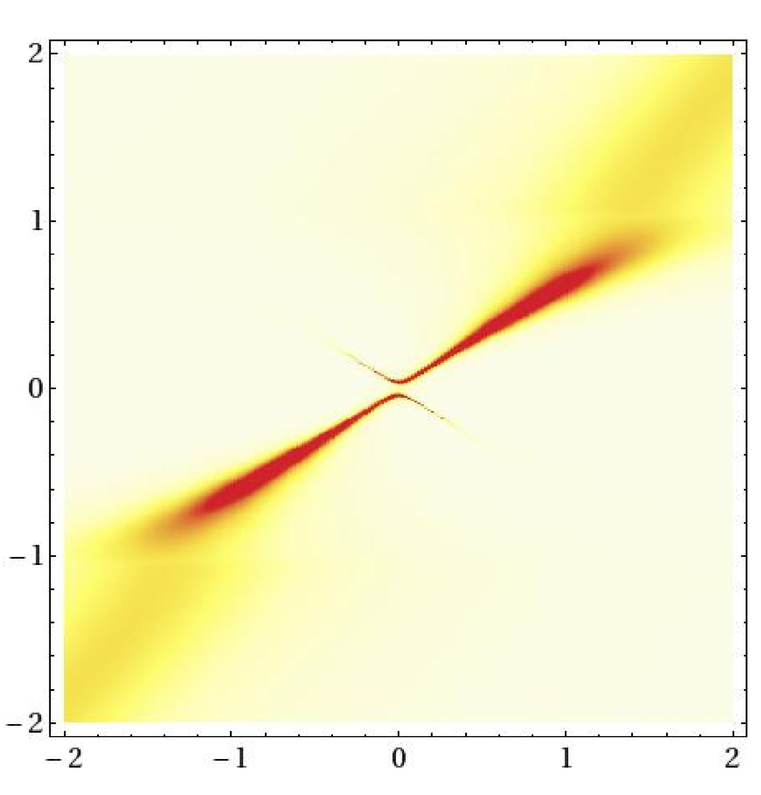
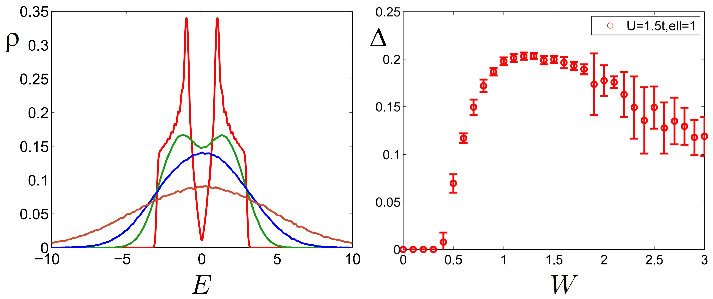

<section>
  <h2>Doctoral thesis</h2>
  <h3>Symmetry and topology of nodal semimetals (2017)</h3>
  
The work investigates the interplay of crystalline symmetry and topological degeneracies in several classes of nodal semimetals. The thesis is freely accessible at the ETH Research Collection, DOI:<a href="https://doi.org/10.3929/ethz-b-000216959" target=”_blank”>10.3929/ethz-b-000216959</a>.

  
 Following the introduction with my insights into topological band theory, the bulk of the work covers three works published during my PhD studies, namely:
    <ol>
      <li>Weyl semimetals in breathing pyrochlore oxides  [T. Bzdušek, A. Rüegg, and M. Sigrist, <i>Weyl semimetal from spontaneous inversion symmetry breaking in pyrochlore oxides</i>, Phys. Rev. B <b>91</b>, 165105 (2015), DOI:<a href="https://doi.org/10.1103/PhysRevB.91.165105" target=”_blank”>10.1103/PhysRevB.91.165105</a>]</li>
      <li>Nodal rings and nodal chains imposed by non-symmorphic symmetry  [T. Bzdušek, Q.S. Wu, A. Rüegg, M. Sigrist, and A. A. Soluyanov, <i>Nodal-chain metals</i>, Nature <b>538</b>, 75–78 (2016), DOI:<a href="https://doi.org/10.1038/nature19099" target=”_blank”>10.1038/nature19099</a>]</li>
      <li>Homotopy classification of generic band nodes depending on Hamiltonian symmetry  [T. Bzdušek and M. Sigrist, <i>Robust doubly charged nodal lines and nodal surfaces in centrosymmetric systems</i>, Phys. Rev. B <b>96</b>, 155105 (2017), DOI:<a href="https://doi.org/10.1103/PhysRevB.96.155105" target=”_blank”>10.1103/PhysRevB.96.155105</a>]</li>
    </ol>

  
 The research was done in the group of <a href="https://itp.phys.ethz.ch/people/person-detail.html?persid=31006" target=”_blank”>Manfred Sigrist</a>, and under the further supervision of <a href="https://scholar.google.com/citations?user=LQne6vMAAAAJ&hl=en" target=”_blank”>Andreas Rüegg</a> and <a href="https://scholar.google.com/citations?user=51ccQ8YAAAAJ&hl=en" target=”_blank”>Alexey A. Soluyanov</a>. My doctoral thesis was recognized by the <a href="https://ethz.ch/content/dam/ethz/main/eth-zurich/education/auszeichnungen-preise/files/eth-medaille/medaille-doktorarbeit-2017.pdf" target=”_blank”>Silver Medal</a> of ETH Zürich, and by the <a href="https://www.weizmann.ac.il/feinberg/about/dimitris-n-chorafas-prize/about-foundation-and-prize#:~:text=The%20Dimitris%20N.,significance%20attached%20to%20its%20aftermath." target=”_blank”>Dimitris N. Chorafas Prize</a> by the Dimitris N. Foundation and the Weizmann Institute of Science.

  
I was awarded the title "DrSc." on 19 Jan 2018.

  
</section>

<section>
  <h2>Master's thesis</h2>
  <h3>Anomalous spectral function of a superconductor (2013)</h3>
  
In superconductors the electron propagator has to be replaced by the Nambu-Gor'kov propagator. The latter is a matrix function, and both the diagonal and the off-diagonal component have Källen-Lehmann spectral representation. While the diagonal spectral function has a probabilistic interpretation and can be readily measured by angle-resolved photoemission spectroscopy, the off-diagonal component is more elusive and at present cannot be experimentally accessed. 

  
I was awarded the title "Mgr." on 16 Jul 2013.

  
</section>

<section>
  <h2>Bachelor thesis</h2>
  <h3>Study of superconductivity in the disordered Hubbard model (2010)</h3>
  
I was awarded the title "Bc." on 26 Oct 2010.

  
</section>
