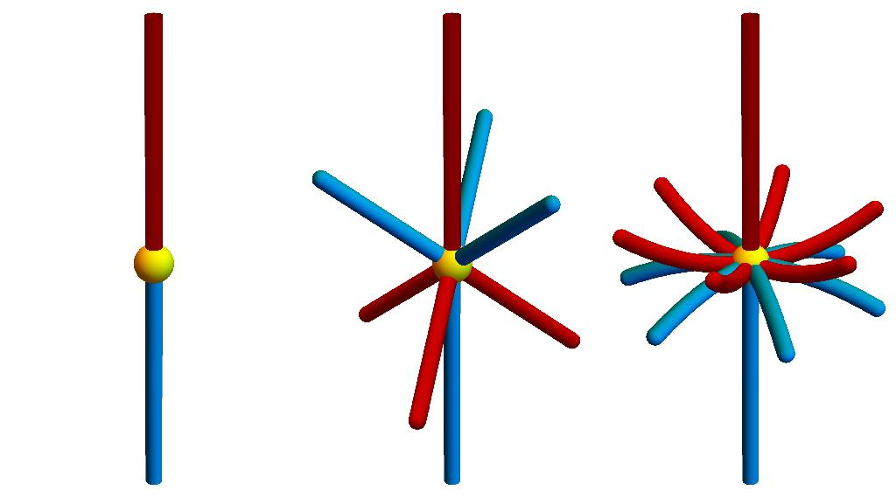
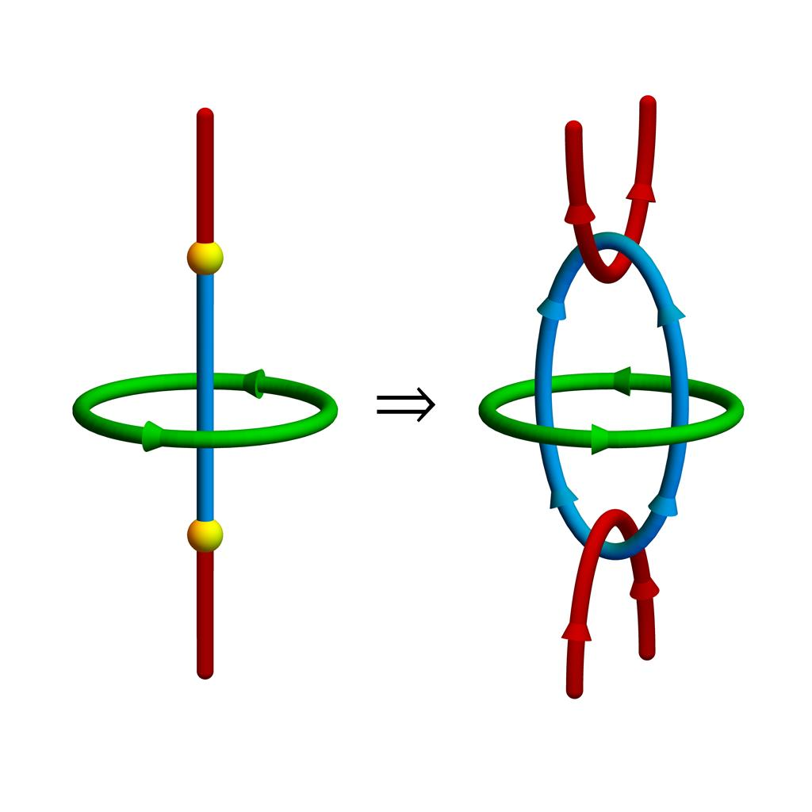

<section>

Electron band structures, which describe the energy-momentum relation for electrons in solids, can exhibit robust crossings called "nodes". Such nodes famously occur in graphene or in Weyl semimetals, and often facilitate special transport phenomena, such as the decrease of resistivity of Weyl semimetals in applied parallel magnetic field. Resembling topological insulators, these "topological (semi)metals" exhibit "exotic" surface signatures which are strictly impossible in bulk materials. In this work, we consider three-fold band crossings called "triple points" in systems with space-time inversion symmetry and weak spin-orbit coupling.

   <figure>
   
   <figcaption>Figure 1. Three classes of triple nodal points identified in systems with negligible spin-orbit interaction.</figcaption>
   </figure>

We classify triple points, which are enforced by three-, four- or six-fold rotation symmetry. Interestingly, we find that depending on the symmetry details the triple points fall into three classes: they can be bare or have six or twelve nodal lines additional to the vertical one sticking out (see Fig. 1). Because three bands are crossing at a triple point, a topological description of triple points is challenging. However, based on a recently introduced multiband theory, we find that the three classes of triple points are "topologically distinct", which means that even after breaking the rotation symmetry, they can be distinguished. In particular, we demonstrate that under strain the bare triple points always convert into linked nodal lines (see Fig. 2).

   <figure>
    
   <figcaption>Figure 2. Converion of type-A triple point into a multi-band nodal link.</figcaption>
   </figure>

 Fascinatingly, this conversion unveils that triple points could be related to so-called "higher-order topology", which is characterized by "exotic" signatures not on the surface but for example on the hinges of a material. Thereby our work furthers the understanding of the relationship between specific band nodes and topology. 

</section>
